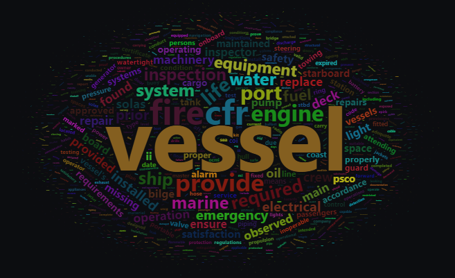

Violations On Vessels visiting the US
================
Kit Applegate
2023-07-06

The provided code performs several tasks. It begins by loading necessary
libraries and setting up the code chunk options. Next, it reads in data
from a CSV file (vessel.Defs.csv) using fread. The data is then
processed to filter out specific system strings and create a summary of
the total system deficiencies. Following that, the code tokenizes the
description column, removes stop words, and calculates word frequencies.
Finally, it generates a word cloud image based on the word frequencies.
The resulting word cloud visualizes the most frequently occurring words
in the descriptions.

``` r
library(tidyverse)
library(tidymodels)
library(data.table)
library(tidytext)
library(lubridate)
library(wordcloud2)
library(rmarkdown)

strings <- c("Sector", "Marine Safety Unit", "Marine safety Detachment", "Detached Duty", "Detached")

Vessel.Defs <- fread("Data/vessel.Defs.csv", encoding = "UTF-8")

system.string <- c("Navigation", "Stability", "Lifesaving", "Engineering", "Communications", "Fire Fighting", "Construction/Loadline",
            "Documentation", "Electrical", "Electrical", "Personnel")

Vessel.Defs <- Vessel.Defs %>%
  filter(!System %in% system.string)
```

``` r
Vessel.Defs %>%
  group_by(System) %>%
  summarise(Total.System.Deficiencies = n()) %>%
  arrange(desc(Total.System.Deficiencies))
```

    ## # A tibble: 17 × 2
    ##    System                                                 Total.System.Deficie…¹
    ##    <chr>                                                                   <int>
    ##  1 07 - Fire Safety                                                        18055
    ##  2 11 - Life Saving Appliances                                             16934
    ##  3 13 - Propulsion and Auxiliary Machinery                                 16484
    ##  4 09 - Working and Living Conditions                                      11534
    ##  5 02 - Structural Conditions                                              10063
    ##  6 01 - Certificates & Documentation                                        9280
    ##  7 10 - Safety of Navigation                                                6247
    ##  8 99 - Other                                                               4954
    ##  9 03 - Water/Weathertight Conditions                                       4261
    ## 10 04 - Emergency Systems                                                   3935
    ## 11 05 - Radio Communications                                                2980
    ## 12 14 - Pollution Prevention                                                2460
    ## 13 08 - Alarms                                                              2429
    ## 14 06 - Cargo Operations Including Equipment                                1891
    ## 15 15 - Safety Management Systems (ISM)                                     1615
    ## 16 18 - Maritime Labour Convention (Not Applicable to PS…                    441
    ## 17 12 - Dangerous Goods                                                      182
    ## # ℹ abbreviated name: ¹​Total.System.Deficiencies

``` r
tidy_text <- Vessel.Defs %>%
  unnest_tokens(word, Description)

set.seed(123)
word_freq <- tidy_text %>%
  count(word, sort = TRUE) %>%
  anti_join(stop_words) %>%
  mutate(word = gsub("\\d+", "", word)) %>%
  filter(word != "") %>%
  arrange(desc(n))
```


